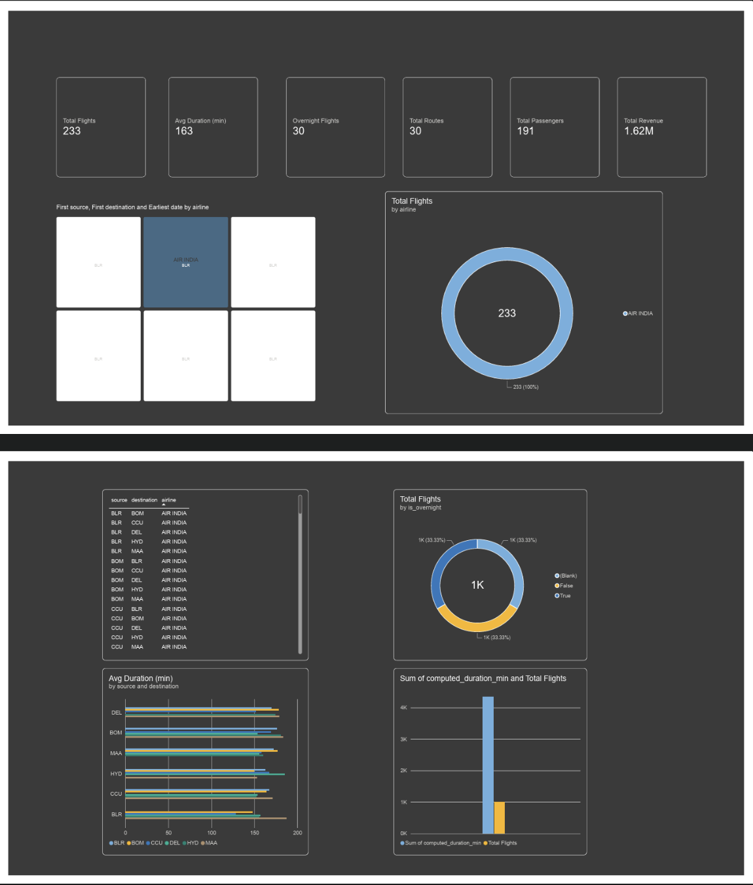
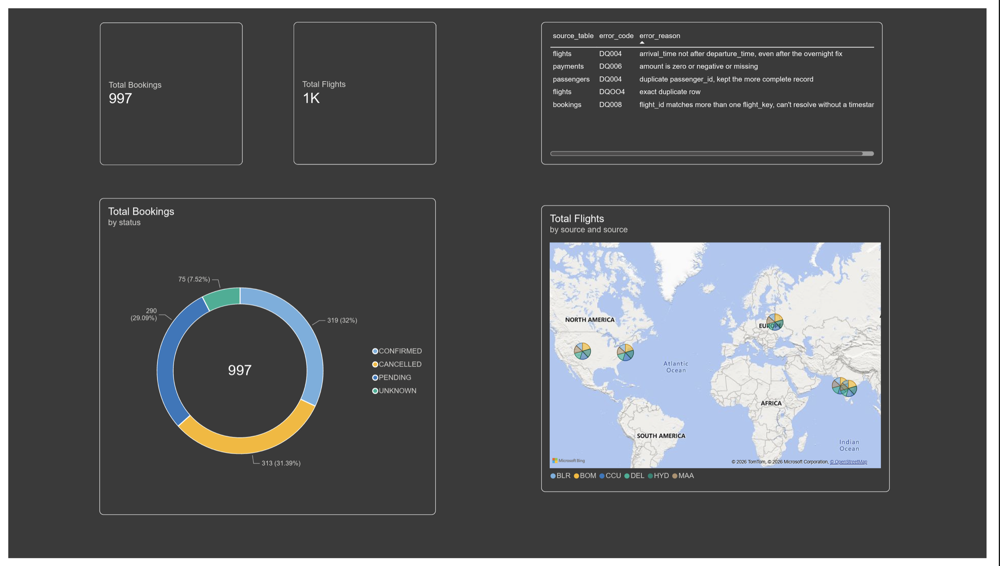
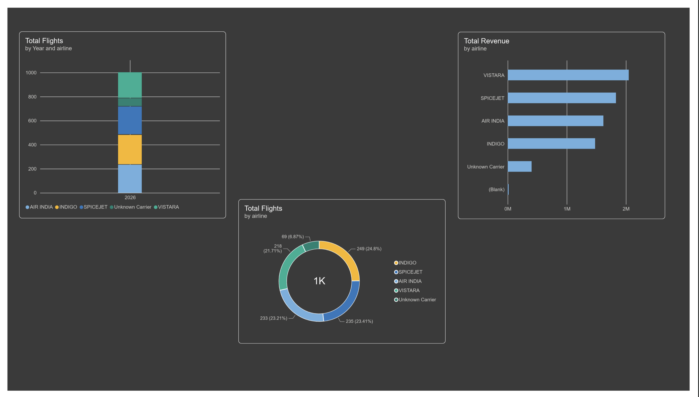

# ASG Airlines — End-to-End Data Engineering Pipeline

An end-to-end data pipeline built for the ASG Airlines case study: raw flight, booking, passenger, and payment data is ingested from a single multi-sheet Excel source and pushed through a **Bronze → Silver → Gold** architecture, with a **quarantine table** for anything that fails validation (nothing is silently dropped) and **PII hashing** for passenger data before it reaches the reporting layer.

Built and run on **Databricks** (notebook is portable to any local Python environment — see [Running Locally](#running-locally-outside-databricks) below).

---

## Table of Contents

- [Problem Statement](#problem-statement)
- [Architecture](#architecture)
- [Repository Structure](#repository-structure)
- [Dataset](#dataset)
- [Pipeline Walkthrough](#pipeline-walkthrough)
- [Data Quality & PII Handling](#data-quality--pii-handling)
- [KPIs](#kpis)
- [Running Locally (outside Databricks)](#running-locally-outside-databricks)
- [Dashboard](#dashboard)
- [Tech Stack](#tech-stack)
- [Documentation](#documentation)

---

## Problem Statement

ASG Airlines collects operational flight data from three separate systems — a booking platform, a scheduling system, and airport logs. The raw data has real, intentional quality issues: corrupted flight identifiers, inconsistent timestamps, missing values, and unhandled overnight (cross-day) flights. This pipeline ingests, validates, cleans, and models that data into an analytics-ready star schema, while protecting passenger PII, so it can support accurate reporting on flight duration, route traffic, delays/anomalies, and airline distribution.

## Architecture

```
SOURCE (Excel: flights, bookings, passengers, payments)
        │
        ▼
BRONZE   — raw, as-is, full PII, restricted access
        │
        ▼   validation checks run here
        ├── fails a check ──► QUARANTINE (row + error_code + error_reason + pipeline_run_id)
        └── passes ─────────►
SILVER   — deduplicated, standardized, duration recomputed from timestamps,
           overnight/anomaly flags applied, referential integrity enforced
           PII HASHED (SHA-256 + salt) here — raw PII does not exist past this point
        │
        ▼
GOLD     — star schema (dim_airline, dim_route, dim_date, dim_passenger,
           fact_flights, fact_bookings, fact_payments) + data_quality_metrics
        │
        ▼
POWER BI — reads Gold-layer CSVs only
```

**Why quarantine instead of deleting:** every row that fails a check is preserved with a reason code and the pipeline run that caught it, so it's reprocessable rather than silently lost.

**Why PII is masked at the Bronze→Silver boundary, not in a parallel branch:** this way raw PII physically stops existing past Bronze — a stronger privacy guarantee than keeping an untouched copy alongside the cleaned data.

## Repository Structure

```
ASG-airlines-data-pipeline/
├── README.md
├── requirements.txt
├── .gitignore
├── data/
│   └── raw/
│       └── UseCase_-_Airlines.xlsx     ← original source file (4 sheets)
├── notebooks/
│   └── ASG_Airlines.ipynb              ← the full pipeline, markdown-annotated
├── docs/
│   ├── ASG_Airlines_Yamini.D.docx       ← architecture, assumptions, data model, cleaning logic
│   └── images/
│       ├── dashboard_overview.png
│       ├── dashboard_bookings.png
│       └── dashboard_airlines.png
└── powerbi/
    └── ASG_Airlines Dashboard.pbix
```

> Pipeline outputs (`data/cleaned/`, `data/pii_vault/`, `data/quarantine/`) are generated by running the notebook and are gitignored rather than committed, they're regenerated on every run, not source data.

## Dataset

The source file is a 4-sheet Excel workbook, not a flat CSV:

| Sheet | Contents |
|---|---|
| `flights` | flight_id, airline, source, destination, departure_time, arrival_time, duration |
| `bookings` | booking_id, passenger_id, flight_id, status |
| `passengers` | passenger_id, name, age, gender, email, phone, aadhaar_id, date_of_birth |
| `payments` | payment_id, booking_id, amount, payment_method |

Referential integrity across sheets is checked, not assumed — every `booking.flight_id` is validated against `flights`, and every `payment.booking_id` against `bookings`.

## Pipeline Walkthrough

The notebook is organized into clearly labeled, markdown-annotated sections:

1. **Setup & ingestion** — load all four sheets from the Excel source
2. **Profiling** — null counts and duplicate rows per table, logged before any changes are made
3. **Type correction** — `amount` coerced to numeric, `aadhaar_id` to string, `status` standardized
4. **Quarantine framework** — a reusable function that tags and sets aside bad rows instead of dropping them
5. **Flight validation** — timestamp parsing, flight_id format checks, overnight-flight handling (arrival date rolled forward when the gap is under 12 hours), `is_overnight` flag
6. **Booking validation** — referential integrity against `flights`, plus a logical-impossibility check (a booking made after its flight already departed)
7. **Payment validation** — referential integrity against `bookings`, and zero/negative/missing amounts flagged separately from each other
8. **Silver layer** — Aadhaar format validation (must be a valid 12-digit number), duplicate `passenger_id` handling, a `flight_key` surrogate key since raw `flight_id` is reused across different routes
9. **PII masking** — SHA-256 + salt hashing of passenger PII, isolated into a separate restricted vault table
10. **Gold layer** — star schema build: dimension and fact tables
11. **KPI calculation** — computed once in the pipeline, not recalculated per Power BI filter
12. **Data quality metrics** — valid-record rate and field completeness logged per table, per run
13. **Export** — Gold tables, PII vault, and the quarantine table written out as CSV

## Data Quality & PII Handling

- **Quarantine, not deletion.** Every rejected row keeps its original data plus `source_table`, `error_code`, `error_reason`, and `pipeline_run_id`, so it can be reprocessed later.
- **PII protection.** `aadhaar_id`, `email`, `phone`, and other sensitive passenger fields are SHA-256 hashed with a project salt before reaching the Gold layer. The identifiable vault table is kept physically separate and treated as restricted.
- **Ambiguity called out explicitly, not hidden:** `flight_id` is not a reliable primary key on its own (it's reused across different routes), so a `flight_key` surrogate is introduced. Because `bookings` only carries `flight_id` (not a timestamp), a booking against a reused `flight_id` can't always be pinned to one exact flight — this is documented rather than silently resolved.

## KPIs

- Average flight duration
- Route-wise traffic
- Anomaly rate (duration-based outlier detection per route)
- Flight distribution by airline
- Revenue by route
- Data quality score (valid-record rate, field completeness) per table, per pipeline run

## Running Locally (outside Databricks)

The pipeline is plain **pandas** — no Spark — so it runs anywhere Python does. The only Databricks-specific pieces are two magic commands and the input/output file paths (Databricks Unity Catalog `/Volumes/...` paths). To run it locally or on another platform (Colab, plain Jupyter, etc.):

**Remove these cells:**
- `%pip install openpyxl` — this is a Databricks notebook magic; install dependencies from `requirements.txt` in your terminal instead
- `%restart_python` — Databricks-only; not valid outside Databricks and safe to delete

**Change these paths:**

| Variable | Databricks (current) | Local (change to) |
|---|---|---|
| `FILE_PATH` | `/Volumes/workspace/default/airline_data/UseCase - Airlines.xlsx` | `data/raw/UseCase_-_Airlines.xlsx` |
| `GOLD_PATH` | `/Volumes/workspace/default/airline_data/cleaned` | `data/cleaned` |
| `VAULT_PATH` | `/Volumes/workspace/default/airline_data/pii_vault` | `data/pii_vault` |
| `QUARANTINE_PATH` | `/Volumes/workspace/default/airline_data/quarantine` | `data/quarantine` |

**Add this (local setup, once):**
```bash
python -m venv .venv
source .venv/bin/activate        # Windows: .venv\Scripts\activate
pip install -r requirements.txt
jupyter notebook notebooks/ASG_Airlines.ipynb
```

Everything else in the notebook that is profiling, validation, quarantine logic, Silver transformations, PII hashing, Gold star-schema build, KPI calculation runs identically outside Databricks, since none of it depends on Spark or the Databricks runtime.

## Dashboard

The Power BI dashboard is built across three report pages, all connected to the Gold-layer CSVs.

**Flight Overview** — KPI cards for total flights, average duration, overnight flights, total routes, total passengers, and total revenue, plus a breakdown of first source/destination by airline, average duration by route, and the overnight vs. non-overnight split.



**Bookings & Data Quality** — booking counts by status, a live view of quarantined records with their error codes and reasons, and total flights by source route.



**Airline Performance** — total flights and revenue by airline, and flight volume by year.



*(These are static previews — for the full interactive dashboard with working filters and slicers, open `powerbi/ASG_Airlines Dashboard.pbix` in Power BI Desktop.)*

## Tech Stack

`Python` · `pandas` · `NumPy` · `Databricks` · `Power BI`

## Documentation

Full write-up — architecture diagram, data flow diagram, data model, assumptions, and the complete cleaning/transformation rationale — is in [`docs/ASG_Airlines_Yamini.D.docx`](docs/ASG_Airlines_Yamini.D.docx).
